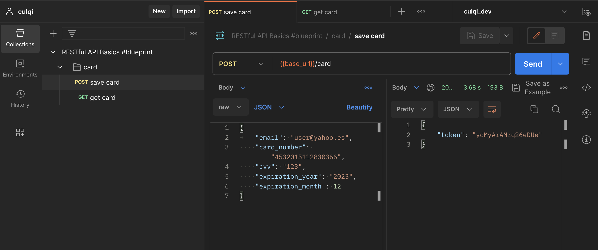

# aws-culqui
## Despliegue local

Ejecutar el comando de instalación de NPM dentro de la carpeta culqui

``` bash
$ cd culqui
$ npm i
$ cd ..
```

Ahora generamos el build y lo desplegamos en lambda

```bash
$ sam build
$ sam deploy --guided
```

Para correr el proyecto de forma local podemos ejecutar
```bash
$ sam local start-api
```

# Postman
Para ejecutar los end-point podemos utilizar el archivo

```
culqi_challenge.postman_collection.json
```

Se deberá crear dos entornos (local, prod) con la variable "base_url"
- local: http:localhost:3000
- prod: 
https://qqg2ydzmoe.execute-api.us-east-2.amazonaws.com/Prod