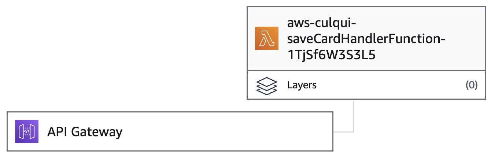
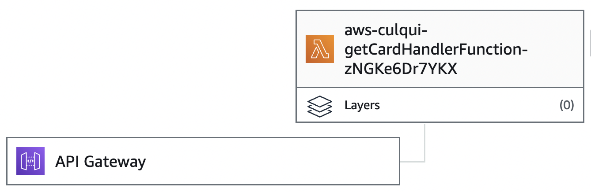

# aws-culqui

## Requisitos
Los siguientes requisitos cubren el ambito de desarrollo y la herramienta para realizar el despliegue.
- [AWS-CLI](https://docs.aws.amazon.com/cli/latest/userguide/getting-started-install.html).
Manual de instalación. Importante realizar la configuración de las credenciales.
- [SAM](https://docs.aws.amazon.com/serverless-application-model/latest/developerguide/install-sam-cli.html).
Manual de instalación.


## Despliegue local

Ejecutar el comando de instalación de NPM dentro de la carpeta culqui.

``` bash
$ cd culqui
$ npm i
$ cd ..
```

Ahora generamos el build y lo desplegamos en lambda

```bash
$ sam build
```

Para correr el proyecto de forma local podemos ejecutar
```bash
$ sam local start-api
```

## Despliegue en AWS
Despues de tener el proyecto contruido necesitamos ejecutar el comando de "sam" para generar el despliegue.
```bash
$ sam deploy --guided
```
Tomar en cuenta cuando el promp pregunte por el deploy del hangese, ya que estos son los cambios que requerimos tener en la nuve.

## Diagrama de despliegue



## Referencia del API

#### Save Card

```http
  POST /card
```

Request:
| Field | Type     | Description                       |
| :-------- | :------- | :-------------------------------- |
| `email`      | `string` | **Requerido**. Email del propietario de la tarje |
| `card_number`      | `string` | **Requerido**. Numero de tarjeta |
| `cvv`      | `string` | **Requerido**. Numero de cvv de la tarje |
| `expiration_year`      | `string` | **Requerido**. Año de expiración de la tarje |
| `expiration_month`      | `string` | **Requerido**. Mes de expiración de la tarjeta |

Response:
| Field | Type     | Description                       |
| :-------- | :------- | :-------------------------------- |
| `token`      | `string` | 16 caracteres de token. Este es valido por 1 minutos |

#### Get Card

```http
  GET /card?token={token}
```

| Parameter | Type     | Description                |
| :-------- | :------- | :------------------------- |
| `token` | `string` | **Requerido**. Token asociado a la tarjeta |

Response:
| Field | Type     | Description                       |
| :-------- | :------- | :-------------------------------- |
| `email`      | `string` | **Requerido**. Email del propietario de la tarje |
| `card_number`      | `string` | **Requerido**. Numero de tarjeta |
| `expiration_year`      | `string` | **Requerido**. Año de expiración de la tarje |
| `expiration_month`      | `string` | **Requerido**. Mes de expiración de la tarjeta |

# Postman
Para ejecutar los end-point podemos utilizar el archivo

```
culqi_challenge.postman_collection.json
```

Se deberá crear dos entornos (local, prod) con la variable "base_url"
- local: http:localhost:3000
- prod: 
https://qqg2ydzmoe.execute-api.us-east-2.amazonaws.com/Prod